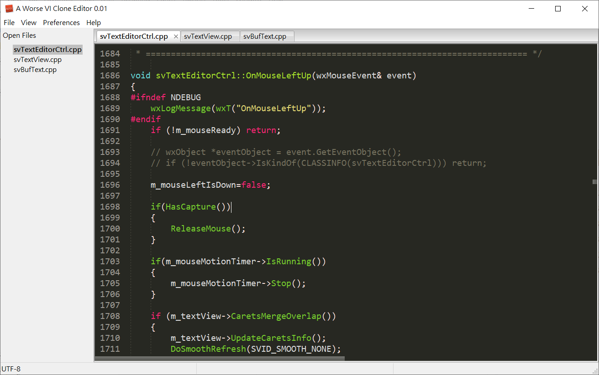

# awvic

Awvic is a Text editor project which aim to clone a VI(M) by myself in the beginning. But in current status, it's almost nothing like a VI(M) clone but like a modern editor such Sublime text or Notepad++. Of course, there are still much functions to be add to making Awvic acting like a real professional editor.

## Features
a. Syntax hilighting and folding. 
b. Multiple carets. 
c. Search and replacement with or without regular expression. 
d. Completion suggesting. 
e. Multiple file editing(Tab). 
f. Unicode. 
g. Theme. 
h. Cross platform (Windows, Linux and OSX) 
i. File encode detecting. 
j. Bugs, varity and plenty of bugs. 

What features Awvic aim to have. 
a. Sublime text features I frequently used. 
b. VI(M) command. 
c. Plugin API. 
d. More customizable. 

## How to build Awvic.

Awvic is written in C++ with wxWidgets, ICU and jsoncpp. You have to install these library before build Awvic. I am using CMake & Visual Studio C++ 2013 Express to build Awvic in Windows, and using CMake to build in Linux. There should be no problem to build Awvic with other building tools you familiar with. As for OSX, I don't have the environment to testing now, but the way to build should be the same with CMake too. 
To build awvic with Visual Studio 2013 on Windows. Please set system variables WXWIN and ICU_DI. WXWIN for wxWidgets library path and ICU_DIR for icu library path. Or you can modify the setting to your environment path on Visual Studio's project property. 

Library require to build Awvic: 
a. C++11 compiler (A few C++11 features were used). 
b. wxWidgets 3.0 (2.9 should be all right). 
c. ICU 5.2. (Later version should be all right). 
d. jsoncpp 1.0.0. 

Building tools: 
a. CMake 3.1.0 (Later version sould be all right). 

## License.

See the LICENSE Notice on src/awvic.cpp. In summary, Awvic is licensed under the Revised BSD License.

## Miscellaneous functions had been done so far.

a. Ctrl+F3 for searching current world with F3 for next search and Ctrl+F3 to search previous. 
b. Ctrl+F for search panel. 
c. Ctrl+G for goto line #. 
